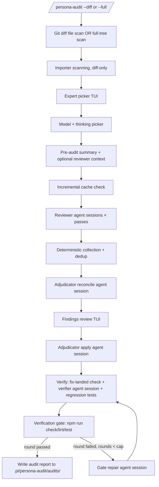

# pi-topping-persona-audit

A [Pi coding agent](https://github.com/earendil-works/pi) extension that implements **`/persona-audit`** — multi-persona code reviews with interactive TUI expert selection and findings triage.


## Features

- **Multi-persona reviews** — Runs parallel reviewer agents with distinct personalities (security, correctness, style, performance, etc.)
- **Deterministic orchestration** — The entire audit is driven by TypeScript, not by an LLM following instructions; LLMs run only where judgment is required (reviewer passes, adjudication, fix application), each in an isolated in-process agent session
- **TUI expert picker** — Interactive terminal UI to select a reusable reviewer roster or individual personas. Rosters appear alphabetically first; individual reviewers remain one cross-tier multi-select list with type-to-filter, `Space` to toggle, `←`/`→` to set 1–5 passes, and `Enter` to confirm.
- **Pre-audit context summary** — Before a normal audit starts, review the selected personas and run settings, then optionally enter shared reviewer guidance. Put an existing `.png`, `.jpg`, `.jpeg`, `.gif`, or `.webp` path on its own line to attach it to every reviewer pass (maximum 5 images, 5 MiB each). Raw guidance and image data never reach later phases or reports.
- **Live progress table** — One compact table above the editor tracks every reviewer pass, adjudicator run, and verification script with live context usage, an output-activity meter (e.g., "1.2K tokens"), the tool call in flight, turn count, and elapsed time; a phase/model band shows which model is assigned to each phase and highlights the one in progress, and a frozen copy is left in the transcript on completion, visible but excluded from the model's context on later turns
- **Findings review** — Accept, reject, or defer individual findings before applying fixes. Each finding has a simplified-technical-English Summary, its authoritative Rationale, and a Suggested Change; summaries also persist in reports and deferred handoffs. Press Esc twice to cancel — the first press arms the confirmation, any other key resumes; press `H` during review to write deferred findings to a handoff file under `.pi/persona-audit/handoffs/`; `↑`/`↓` navigate, `PageUp`/`PageDown` move by a page, `S` cycles file/priority/reviewer/blast-radius sorting, `A`, `R`, and `D` set a finding to apply, reject, or defer, `Space` cycles apply → reject → defer, `F` fixes the selected finding now (the fix agent also updates existing tests the fix invalidates, without weakening them; the edits land in the diff and the fix commit), and `Enter` confirms. Blast radius is a deterministic 0–100 risk score from direct importer fan-in, sensitive code surfaces, test coverage, and the reviewer's change-kind classification; the overlay shows its Low/Medium/High/Critical bucket and leading reasons.
- **Auto-fix** — Accepted findings are partitioned by file and applied by parallel edit-capable adjudicator agent sessions, then verified against the project's own `check`/`lint`/`test` scripts. Each agent also updates existing tests that its fixes invalidate, without weakening them, and reports them under Tests Updated
- **Fix verification** — Every accepted fix gets its own verdict: the file is hashed before and after the implement phase, a verifier agent session diffs each change against its finding, and high-severity bug/security fixes get a regression test the harness proves fails without the fix
- **Incremental cache** — Reviewer passes are cached by manifest+selection hash; unchanged re-runs skip agent-session spawns
- **Durable progress** — A partial report is updated after every reviewer pass; cancellation or failure never loses completed work
- **Audit report viewer** — Opens the completed report in a scrollable Markdown overlay; use arrows to scroll, `u`/`d` to page, `g`/`G` for top/bottom, and `Esc` to close. Cancelled audits do not open the viewer.
- **Audit report** — Generates a structured report in `.pi/persona-audit/audits/`
- **Settings menu** — `/persona-audit-settings` configures reusable reviewer rosters, the progress table's activity monitor (color and scroll direction), the Linus Torvalds reviewer's temperament, and the fix + verify round cap
- **Artifact purge** — `/persona-audit-purge [--older-than <days>]` lists audit reports, progress snapshots, handoffs, pre-fix snapshots, and this repo's reviewer cache for explicit tagging and permanent deletion. Each section explains its retention purpose and parent folder; press `P` to preview Markdown or pretty-printed JSON before deleting. Unknown files and `settings.json` are never touched; deleting cache entries forces fresh reviewer passes.

## Install

```bash
pi install npm:@underactive/pi-topping-persona-audit
```

Restart Pi (or run `/reload`) to pick it up.

The extension registers itself automatically via `package.json` — Pi discovers it when installed as a dependency or linked into a Pi workspace.

## Usage

### Via Pi chat

```
/persona-audit --diff [--base <commit>] [path]
/persona-audit --full [path] [--exclude <dir-or-path>]...
/persona-audit-purge [--older-than <days>]
```

Exactly one of `--diff` or `--full` is required.

- **`--diff`** — focused reviews of only changed files and their direct importers. Requires a git repository.
- **`--full`** — a deterministic whole-tree scan of the given path. No git repository required — use this for plain-filesystem projects, generated exports, or any directory that isn't (yet) a git repo.

#### Command Options

- `--diff` — Enable diff-based mode (mutually exclusive with `--full`)
- `--full` — Enable full-tree mode, no git required (mutually exclusive with `--diff`)
- `--base <commit>` — Base commit to diff against, `--diff` only (default: merge-base with main)
- `--exclude <dir-or-path>` — Exclude a directory from `--full`; repeat the flag for multiple exclusions. A value without a path separator matches that exact directory name at any depth. A value with a separator matches one exact project-root-relative directory path. Values are literal, not globs or comma-separated lists.
- `[path]` — Optional path filter (default: "."). Quote paths and exclusions containing spaces. Exclusions outside the selected scope or paths that do not exist are harmless no-ops; built-in vendor/build/cache exclusions always remain active.
- `/persona-audit-purge [--older-than <days>]` — tag and permanently delete recognized audit artifacts. `--older-than` pre-tags old audit artifacts only; reviewer-cache entries always require explicit tagging. Press `P` on a Markdown or JSON row for a read-only preview.

#### Examples

```bash
# Review changes since merge-base with main
/persona-audit --diff

# Review changes since a specific commit
/persona-audit --diff --base abc123

# Review changes in src/ directory only
/persona-audit --diff src/

# Review changes since 5 commits ago in components
/persona-audit --diff --base HEAD~5 src/components

# Audit an entire project that isn't a git repo
/persona-audit --full

# Audit a subdirectory but omit every directory named tests
/persona-audit --full src/components --exclude tests

# Omit multiple directories, including one exact project-root-relative path
/persona-audit --full src --exclude tests --exclude src/generated

# Quote scope and exclusion values containing spaces
/persona-audit --full "src/my components" --exclude "my tests"
```

### Settings

```
/persona-audit-settings
```


| Setting | Values | Default |
| --- | --- | --- |
| Token activity monitor color | `accent`, `border`, `borderAccent`, `success`, `error`, `warning` | `accent` |
| Token activity monitor direction | Left to Right, Right to Left | Right to Left |
| Linus Torvalds temperament | neutral (min), caustic, LKML (max) | neutral (min) |
| Max fix + verify rounds | `1`–`10` | `3` |
| Reviewer rosters | Up to 20 named reviewer combinations | None |

Reviewer roster names are 1–24 alphanumeric characters and are unique without regard to case. Each roster contains 1–10 unique reviewers. Open **Reviewer rosters** to create, edit, rename, clear slots with `Backspace`/`Delete`, or delete with confirmation. The editor always shows ten slots and filters already-used reviewers out of later slot pickers. Roster and other setting changes are staged together: only the top-level **Save** writes them; **Cancel** or `Esc` discards the whole settings draft.

In `/persona-audit`, valid rosters are listed alphabetically above the individual reviewer tiers. Filtering matches roster and member names. `Enter` expands a roster directly into its current valid reviewers at one pass each; roster rows do not respond to `Space` or pass controls, and rosters above the normal run threshold use the same second-`Enter` cost confirmation. Reviewer names that no longer exist remain in settings but are omitted at use time; a roster with no current reviewers is hidden.

The first two control the progress table's MONITOR column (see [Progress table](#progress-table)).
Max fix + verify rounds caps the automatic gate-repair loop (see [Fix + verify rounds](#fix--verify-rounds)):
round 1 is the initial verify, and each round after it is one auto-repair attempt, so `1` turns
auto-repair off and `10` allows up to nine repairs before the run gives up.
Temperament sets the register of the Linus Torvalds reviewer only — tone, not substance: the
focus areas and severity grading are identical at every level, and no level permits abuse
of the author. `caustic` and `LKML (max)` produce deliberately hostile-reading prose in a report
humans have to triage; `LKML (max)` is the register of a vintage kernel-list mail.

All saved changes take effect on the next audit, and changing temperament invalidates the reviewer cache.
Saving writes to `<pi agent dir>/persona-audit/settings.json`, the same file the per-phase model
picker uses, leaving that picker's saved choices untouched.

## Requirements

- **Pi** 0.84.4 or later recommended — that is the version the development dependencies (`@earendil-works/pi-ai`, `@earendil-works/pi-coding-agent`, `@earendil-works/pi-tui`) are pinned to and tested against, and the first whose focused `ctx.ui.custom()` overlays emit the `ui_prompt_start`/`ui_prompt_end` lifecycle events this extension's prompts rely on for accurate user-wait reporting. The published peer dependencies stay `*`, so older hosts still install and run, but cannot emit those lifecycle events. Agent tasks run in-process via the public `createAgentSession()` SDK; no `pi` CLI on PATH is required.
- **Node.js** ≥ 22.x (uses `--experimental-strip-types` or erasable syntax)
- A configured Pi provider/model (providers registered by extensions are replayed onto a fresh runtime by `buildRuntimeWithExtensionProviders`)

## Reviewer personas

The extension includes 40 reviewer personalities. Tiers group them under headers in the picker; they do not constrain a selection, which may draw from any combination of the three:

**Holistic Tier** — Big-picture reviewers:
- Principal Engineer
- Software Architect
- Full-Stack Engineer
- Reliability Engineer
- Staff Engineer

**Specialist Tier** — Focused domain experts:
- Code Quality Engineer
- Security Engineer
- Testing Engineer
- Frontend Engineer
- Backend Engineer
- Performance Engineer
- Accessibility Engineer
- DevOps Engineer
- Data Engineer
- Infrastructure Engineer
- DX Engineer
- Mobile Engineer
- Documentation Writer
- AI Engineer
- Slop Auditor

**Persona Tier** — Famous engineers (and one fictional archetype) and their philosophies:
- Martin Fowler
- Kent Beck
- Sandi Metz
- Rich Hickey
- Anders Hejlsberg
- John Ousterhout
- Kamil Mysliwiec
- Kent Dodds
- Tanner Linsley
- Vladimir Khorikov
- Michael Feathers
- Rob Pike
- Bryan Cantrill
- Charity Majors
- Barbara Liskov
- Casey Muratori
- Titus Winters
- Julia Evans
- Linus Torvalds
- Ponytail Dev

## Scan Modes

- **Diff mode (`--diff`)** — scans changed files from a git diff, then heuristically includes direct importers of changed JS/TS modules.
- **Full-tree mode (`--full [path] [--exclude <dir-or-path>]...`)** — scans a sorted, language-agnostic directory manifest without requiring git, excludes common vendor/build/cache directories plus repeatable command-specific directory exclusions, and caps the scan at 500 files with a warning when extra files are excluded.

## Workflow



1. **File scan** — `--diff` detects changed files using git diff against a base commit; `--full` instead does a deterministic whole-tree directory scan (sorted, capped, no git required).
2. **Importer scanning** — heuristic JS/TS relative-path matching finds direct importers of changed modules in `--diff` mode and computes per-module fan-in for blast-radius scoring.
3. **Reviewer selection and summary** — choose personas and passes in the TUI picker — one cross-tier list, `Space` toggles, typing filters by name, description, or focus area — then assign a model and thinking level per phase. A final summary lists the run and accepts optional shared reviewer guidance. A line containing an existing image path attaches that image; relative paths resolve from the audited working directory. Missing, unsupported, oversized, and over-limit files remain visible as text with a warning. Back returns to the model picker without losing the draft. Handoff resumes skip this reviewer-only step.
4. **Parallel review** — spawn isolated in-process agent sessions per reviewer×pass (cache-aware, concurrency 5). Shared context guides reviewer priorities but cannot override audit scope, safety rules, or the output contract. Context changes invalidate reviewer cache entries; context-free audits retain their prior keys. If any reviewer pass fails, the ReviewerRetry checkpoint lets you retry failed passes (optionally on a different model) or skip them before triage begins.
5. **Collection & adjudication** — parse/dedup findings deterministically, then a read-only adjudicator agent session adds recommendations.
6. **Findings review** — accept, reject, or defer findings in the TUI. Each item shows a simplified-technical-English Summary, the full authoritative Rationale, and a Suggested Change; `↑`/`↓` navigate, `PageUp`/`PageDown` move by a page, `S` cycles sorting by file, severity priority, reviewer, and blast radius, `A`, `R`, and `D` set the selected status directly, `Space` cycles statuses, `F` fixes the selected finding now, and `H` writes current deferred findings to `.pi/persona-audit/handoffs/`. Blast-radius mode orders by the computed 0–100 risk score and shows its bucket plus the top reasons inline.
7. **Fix & verify** — accepted fixes are partitioned by file and applied by up to 3 edit-capable adjudicator agent sessions running in parallel (see [Parallel fix application](#parallel-fix-application)); the extension then verifies each fix individually and runs the project's verification scripts. If the verifier run itself fails, the VerifierRetry checkpoint lets you re-run it on a different model or skip verification.
8. **Gate repair (rounds 2+)** — a round that does not pass `passed` is handed to a repair agent, then every verification layer re-runs from scratch (see [Fix + verify rounds](#fix--verify-rounds)). This repeats automatically, no checkpoint required, until a round passes or the configured round cap (**Max fix + verify rounds**, default 3) is hit.
9. **Report** — write the audit report to `.pi/persona-audit/audits/` and post a chat summary.

### Conflict Resolution

When multiple reviewers flag findings that touch the same code region — the same
function or expression, or within 20 lines of each other — the adjudicator
reconciles them using a fixed precedence chain:

1. **Category** — `security > bug > performance > maintainability > style/documentation`
2. **Severity** (tie-break within the same category) — `critical > high > medium > low > info`
3. **Root cause over symptom**

For example, a HIGH security fix and a HIGH performance fix that both target the
same region: the security fix wins on category priority alone (rule 1 decides it
before severity is consulted). The losing fix is recommended for rejection, with
the adjudicator's reason shown against that finding in the report.

Fixes that touch the same file but different regions (different functions, more
than 20 lines apart) are not contradictory — both are applied, with the
adjudicator re-reading the file before each edit so earlier changes do not
invalidate later ones.

At most 40 fixes are applied per run. The orchestrator enforces that cap with
the same precedence chain before any agent is spawned; findings ranked past it
are reported as deferred rather than dropped.

### Parallel fix application

Accepted fixes are applied by up to 3 adjudicator agent sessions running
concurrently. The orchestrator partitions the work deterministically before any
agent starts:

1. **Rank** all accepted findings by the precedence chain above.
2. **Cap** the list at 40; the remainder becomes overflow, reported as deferred.
3. **Group by file** — every finding targeting the same file goes into the same
   batch, so in-file edits stay sequential. Parallel agents editing one file
   would invalidate each other's `oldText` anchors as lines shift.
4. **Pack** the file groups into at most 3 batches, heaviest group into the
   lightest batch, so agents finish at roughly the same time. Bounding the batch
   count also bounds the prompt overhead each extra agent session re-pays.
5. **Reserve** every other batch's primary files as a per-agent "Reserved
   Files" list, so each agent knows which files it must never touch.

Each agent applies every finding it is handed, editing only its own primary
files plus any existing test files that exercise the code it changed; if such
a test file is on another agent's Reserved Files list, the agent leaves it
alone and reports it under Tests Left Failing instead. The progress table
shows one `Implement` row per batch:

```
  Implement
  ✓ apply · src/auth.ts             fixes applied
  ◐ apply · src/api/handler.ts +2   applying 5…
  Verify
  ○ fix landed                      queued
```

The agents' reports are concatenated into the single document the verifier and
self-report parser already consume. A batch that fails does not sink the run:
the others still land, its own findings are written in as explicit deferrals,
and verification proceeds against whatever actually reached disk. Only a run in
which every batch failed skips verification.

Snapshotting is unaffected — every target file is captured once, before any
agent starts, so the fix-landed check compares against a clean baseline
regardless of how the work was split.

Suggested fixes, applied fixes, and generated regression tests are all held to the Slop Auditor's own criteria (no narration comments, no unrequested guards, no speculative indirection). A finding that can't be fixed without violating those criteria surfaces as deferred, with the violated rule named, rather than being silently applied or rejected.

### Verification

A green `npm run check` says the tree still compiles. It does not say that the
fix you accepted was ever written. The verify phase answers that per finding, in
three layers, before the script gate runs.

**1. Did the fix land?** Every accepted finding's target file is hashed and
copied to `.pi/persona-audit/snapshots/<slug>/pre/` before the implement agent session
starts. Afterwards each file is re-hashed. A byte-identical file is proof the fix
never landed, and that verdict is final — no claim from any LLM can override it.
The implement agent's own "Fixes Applied" report is parsed too, but only as a
cross-check signal: it is the least trustworthy evidence available, since the
agent is reporting on itself.

**2. Does the change address the finding?** A `persona-audit-verifier` agent session
(the Verify model slot) receives each finding along with the path of its pre-fix
snapshot, and runs `diff -u <snapshot> <live>` itself. It returns one verdict per
finding — `fixed`, `partial`, `not-fixed`, or `cannot-verify` — with evidence it
has to point at. Passing snapshot paths rather than diff text keeps the prompt
proportional to the number of findings instead of the size of the change.

**3. Does a test actually catch the bug?** For `critical`/`high` findings in the
`bug` and `security` categories whose fix verified as `fixed` or `partial` (at
most 3 per run), the verifier authors one regression test each. The harness — not
the LLM — then rules on it:

- A detached `git worktree` is created in a temp directory and overlaid with the
  current content of every audited and uncommitted file, so it reproduces your
  working tree rather than bare `HEAD`.
- The test runs there once and must pass. If it does not, the result is
  inconclusive rather than guessed at.
- Only the finding's own file is then reverted to its pre-fix snapshot, and the
  test runs again. It must now fail.
- `proven` requires both. A test that passes either way downgrades its finding
  from `fixed` to `partial`.

The revert happens only inside the throwaway worktree. Your working tree is never
written to, so an interrupted run cannot lose uncommitted work. Creating the
worktree does write `.git/worktrees/` metadata, which is removed when the run
ends. The authored test files are the one thing that lands in your tree — they
are the deliverable. Test commands are executed with `execFile` and no shell,
and must be a single plain invocation of a known test runner.

Without a git repository (`--full` on a non-repo) layer 3 degrades to a single
run against the working tree, reported as `green-only`, and never blocks.

The report ends with a per-finding verdict table and the red/green evidence. The
overall status is `passed` only when every accepted fix verified and every script
passed; a fix that never landed makes the run `failed` even when the scripts are
green. A project with no `check`/`lint`/`test` script in `package.json` has no gate
to pass, so its runs settle at `partial` rather than `passed`.

### Fix + verify rounds

A round that does not come back `passed` is not the end of the run. Round 1 is
the original implement + verify pass above; when it does not pass, the same
edit-capable adjudicator agent gets one more job — repair exactly what
verification found wrong — and then every layer (fix-landed check, verifier,
regression tests, script gate) re-runs from scratch. This repeats until a round
passes or the round cap is hit — the **Max fix + verify rounds** setting, default
3, configurable from 1 (auto-repair off) to 10 in `/persona-audit-settings` — no
checkpoint or user action is required in between.

**What counts as a repair target.** A round hands the repair agent every
`not-fixed` or `partial` verdict, every `cannot-verify` verdict the verifier
could actually judge (excluding files it could not even read), every
non-discriminating regression test, and every failed verification script.
Findings that already verified `fixed` ride along as read-only context so the
repair agent does not re-touch them. If nothing is actionable — for example a
script failed for a reason no finding here touches — the loop stops rather than
spinning.

**Why re-verification is full, not incremental.** Every re-check uses the same
round-1 baseline snapshots, not the previous round's live tree, because a
repair can regress a layer that already passed (fixing one finding can break
another file's fix, or a repaired regression test can start failing the script
gate). A partial re-check would miss that.

**What a repair agent is not allowed to do.** The repair directive explicitly
forbids weakening a gate to make it pass — no deleting or loosening a
regression test's assertions, no relaxing a verification script's command or
config, no removing the code path a fix verdict is judging. Repairing the fix
itself is always the expected path; an unrepairable failure is left unresolved
and named in the round's report entry, not papered over.

**Stopping conditions.** The loop stops when a round passes, when the run is
cancelled, when nothing is actionable, when a round's failures did not change
from a round already seen, or after the configured round cap (the **Max fix +
verify rounds** setting, default 3 — round 1 plus up to that many minus one
repairs; set it to 1 to disable auto-repair) — whichever comes first. The stagnation stop compares each round's
actionable failure set (each fix keyed by its *verdict*, so `not-fixed` →
`partial` still counts as progress and does not trip it) against every earlier
round's, which also catches an `A → B → A` oscillation; when a repair leaves the
set unchanged or returns it to an earlier state, another pass will not move it,
so the remaining round budget is not spent. The final report's Fix + Verify
Rounds table shows every round's status, verdict counts, script gate result, and
what the repair agent reported doing; the per-finding verdict table and chat
summary reflect only the last round.

### Progress table

The nine steps above are the audit's internal state machine. On screen they are
grouped into four phases in a single `aboveEditor` widget, which stays mounted
for the whole run and is torn down on completion, cancellation, `/reload`, and
`/new`:

```
══ Persona-audit ═══════════════════════════════════════════════ src/ ══
       Review          Triage        Implement         Verify     
   claude-opus-4   claude-opus-4       gpt-5      claude-haiku-4-5
───────────────────────────────────────────────────────────
  AGENT                                CTX  MONITOR   ACTIVITY                 TURNS  TOOLS      COST    TIME
  Review
  ✓ Security Engineer  21.2%/200.0K  ⣿⣶⣤⣀⣀⢀⢀⢀  1.2K tokens                2      4    $0.018    0:42
  ◐ Slop Auditor        8.4%/200.0K  ⣴⣤⣤⣀⢀⢀⢀⢀  reviewing…                 1      2    $0.006    0:19
    ↳ grep  "handleRequest"
  ○ Perf Engineer                 —  ⢀⢀⢀⢀⢀⢀⢀⢀  queued                     0      0         —    0:00
  Triage
  ✓ collection                    —  ⢀⢀⢀⢀⢀⢀⢀⢀  84 raw → 31 unique         0      0         —    0:01
  ◐ adjudicator · reconcile  59.5%/200.0K  ⣶⣤⣀⢀⢀⢀⢀⢀  annotating…          1      3    $0.009    0:27
───────────────────────────────────────────────────────────────────────
  2/3 reviewer passes · 31 findings · verify 1/2
```

- **PHASE / model band** — two rows above the `AGENT` header show which model
  is assigned to each phase, centered under that phase's own column. Between
  adjacent columns stands a two-row powerline chevron — a `\` (U+E0B9) on the
  name row stacked over a `/` (U+E0BB) on the model row so the halves read as
  one tall right-chevron — tracing the Review→Triage→Implement→Verify flow
  (needs a Powerline/Nerd Font to render). The phase currently in progress
  (`Triage`, above) renders at normal brightness, and the chevrons touching it
  brighten with it; the rest stay dim. Sourced from the per-phase model + thinking picker shown
  after ExpertPicker; the band is omitted entirely when no phase has an
  assigned model, or when the terminal is too narrow to keep all four columns
  readable.
- **AGENT** — each non-empty phase group starts with a dim phase heading, then
  its rows (`Review` has one row per reviewer×pass, `Triage` has deterministic
  collection and adjudication, `Implement` has adjudicator fix application, and
  `Verify` has fix-landed, verifier, regression-test, and script rows). A round
  that does not pass adds a `gate repair N` row under `Verify`, followed by a
  fresh set of verification rows (see [Fix + verify rounds](#fix--verify-rounds)).
  Headings are render-only; the phase and `firstOfPhase` fields remain in
  snapshots. Every agent row starts with its status icon followed by
  its label, with no phase column or tree connector.
- **CTX** — the latest turn's context size as a percentage of the model's
  context window. When the window cannot be resolved from the provider/model the
  agent session reported, the raw token count is shown instead of a guessed
  percentage. Rows with no model at all (verification scripts) show `—`.
- **MONITOR** — an eight-cell meter driven by generated-output rate. Providers
  that stream `usage.output` drive it exactly; otherwise it is estimated from
  streamed text/thinking deltas. Its color and scroll direction are set in
  [`/persona-audit-settings`](#settings).
- **ACTIVITY** — the row's status, with the tool call currently executing on an
  indented `↳` sub-row beneath it.
- **TURNS / TOOLS / COST / TIME** — assistant turns completed, cumulative tool
  calls, cumulative model cost at `$0.000` precision (`—` when the model cannot be
  resolved), and elapsed time. All four freeze when the row settles and are
  dropped together when the table body is narrower than 96 columns (roughly a
  100-column terminal).

The fixed row layout is status icon + gap + agent label + gap + CTX + gap +
monitor + gap, followed by ACTIVITY and, when eligible, the four stats columns.
The table aims for roughly half the terminal height, keeps the existing chrome
floor, and subtracts one budget row for every rendered phase heading before
allocating agent rows. On a short terminal, `↳` sub-rows and their reserved
placeholders are dropped before any agent row is.

On completion the sticky widget unmounts, and a frozen, read-only copy of the
finished table — settled rows, final meter traces, the footer summary, and an
all-dim band since no phase is active anymore — is written into the transcript
immediately ahead of the Audit Summary message. Unlike that summary message,
the frozen copy is a custom session entry (`pi.appendEntry`) rather than a chat
message, so it stays visible for the user to scroll back to but is excluded
from the model's context on later turns.

The widget never takes keyboard focus — the focused custom overlays (expert
picker, per-phase model picker, findings review, reviewer/verifier retry
checkpoints, settings and purge menus, report viewer) remain the input
surfaces, so Pi can bracket each genuine user wait with its prompt lifecycle
events. Fix Now follows the same split: fixing, verifying, and post-decision
settling render as nested detail under the Implement phase's `fix now · …`
row in the audit table itself (telemetry already lives on that row), while a
raw input listener consuming only Escape provides the double-Escape cancel
gesture (everything else, including Ctrl+C, passes through to the editor).
Only the accept/retry/discard decision opens a fresh focused overlay per
attempt — so only that gate counts as a user wait.

## Architecture

Everything that coordinates the audit is deterministic TypeScript. There is no
child LLM session and no registered audit tools — the former "orchestration
instructions" prose has been replaced by code, and LLM reasoning is confined to
isolated in-process agent sessions: reviewer passes, adjudicator reconcile,
adjudicator implement, the per-finding verifier, and regression-test authoring:

- **Command shell** (`src/index.ts`) — `/persona-audit` and `/persona-audit-settings` arg parsing, git diff scan + importer scan (`--diff`) or deterministic whole-tree scan (`--full`, no git required), cache-key computation, ExpertPicker TUI, progress-widget mounting and context-window resolution, and the final chat summary.
- **Orchestrator** (`src/orchestrator.ts`) — the audit state machine: cache load/merge, reviewer agent-session batches, deterministic collection, adjudicator agent sessions, FindingsReview TUI, verification (including the automatic gate-repair round loop, see [Fix + verify rounds](#fix--verify-rounds)), and report writing. Writes a durable partial report after every reviewer pass and on cancellation/failure.
- **Agent runner** (`src/agentRunner.ts`) — runs each LLM task as an isolated in-process agent session via `createAgentSession()`, with model resolution, extension-provider replay, idle-timeout abort, and live telemetry.
- **Agent discovery & telemetry** (`src/subprocess.ts`) — agent-config discovery from `*.md` frontmatter (`tools`/`model`), concurrency helper, and shared output-activity tracking used by agentRunner.ts.
- **Progress surface** (`src/components/AuditProgress.ts`, `src/components/ReportViewer.ts`, `src/components/SettingsMenu.ts`, `src/activityMeter.ts`) — the phased `aboveEditor` table, post-audit report overlay, the activity monitor's settings menu, and output-rate meter. The table and meter are ported from pi-moa-plan's fan-out widget so the two extensions stay visually consistent while remaining independently installable.
- **Reviewer retry checkpoint** (`src/components/ReviewerRetry.ts`) — shown after a review batch settles with failures; lets the user retry failed passes (optionally on a different model) or skip them before triage.
- **Verifier retry checkpoint** (`src/components/VerifierRetry.ts`) — shown only when the verifier *agent process itself* fails to run (a provider error, not a fix verdict); lets the user re-run it on a different model (which then also authors the regression tests) or skip verification. Ordinary `not-fixed`/`partial` verdicts and failed scripts do not reach this checkpoint — they trigger the orchestrator's automatic gate-repair round instead, with no user action needed.
- **Report & verification** (`src/report.ts`, `src/verify.ts`) — pure report templates (full/compact/partial + chat summary), the `check`/`lint`/`test` verification gate, and the rule that folds per-finding verdicts and script results into one status.
- **Fix verification** (`src/snapshot.ts`, `src/regression.ts`) — pre/post file hashing with pre-fix snapshots and apply-report parsing, and the red/green regression harness that runs authored tests against a throwaway `git worktree`.
- **Prompt data** (`src/skillContent.ts`) — the 40 reviewer personalities plus the reviewer output contract and adjudicator directives composed into agent-session prompts.
- **Agent definitions** (`agents/*.md`) — source of truth for agent-session `tools`/`model` (frontmatter) and base system-prompt bodies, appended to pi's default system prompt at session creation (`appendSystemPromptOverride` in `src/agentRunner.ts`). These ship with the extension and are resolved from the module location, so `/persona-audit` works in any repository without an install step.

**Agent resolution order** — `discoverAgents()` layers three directories, each
overriding the previous on a name collision:

1. `agents/` bundled with this extension (always present)
2. `~/.pi/agent/agents/` — user-level overrides
3. the nearest `.pi/agents/` walking up from the audited repository — project-level overrides, except `persona-audit-*` agents, which this layer may never redefine: it is part of the repository under review.

A stale copy in `~/.pi/agent/agents/` therefore shadows the bundled definitions;
delete it if edits to `agents/*.md` appear to have no effect.

**Cancellation semantics** — Esc in the ExpertPicker cancels cleanly, and two
Escs in FindingsReview do (partial report written, no fixes applied). Esc in the ReviewerRetry
checkpoint, shown when reviewer passes fail, is non-destructive by default: it skips
the failed passes and continues the audit; only the explicit "Cancel audit" button
cancels. Mid-run, `ctrl+shift+c` aborts the audit: the command handler owns its
own AbortController, since `ctx.signal` is unavailable inside command handlers, and it aborts
in-flight agent sessions.

## Key Features

### Diff-Based Auditing

- **Smart base detection** — automatically finds merge-base with main if no base specified
- **Changed file detection** — uses `git diff --name-only --diff-filter=ACMR` for accurate file selection
- **Direct importer scanning** — heuristically finds JS/TS direct importers of changed modules via relative-path matching
- **Scope filtering** — supports path-based filtering of changed files
- **Deterministic results** — no sampling or truncation, consistent file selection

### Importer Detection

The system heuristically scans JS/TS source files for relative-path import/require/export statements:

- `import ... from './file'`
- `require('./file')`
- `import('./file')`
- `export ... from './file'`

This ensures that when you change a module, all files that depend on it are also reviewed.

### Full-Tree Auditing (`--full`)

- **No git required** — works on any directory, including plain-filesystem projects, extracted archives, or generated exports that were never git-initialized
- **Language-agnostic scan** — unlike the diff-mode heuristic JS/TS importer scan, the full-tree manifest uses a broad extension allowlist covering many common languages and config formats
- **Deterministic, capped, never sampled** — the manifest is sorted and capped at 500 files; if the scan finds more, the excess is excluded (not randomly sampled) and a warning is surfaced in chat and in the report so you can narrow `[path]`
- **Built-in and per-command exclusions** — always skips `node_modules`, `.git`, build/output directories, virtualenvs, and common lockfiles across ecosystems. Repeat `--exclude <value>` to add literal directory exclusions for one full-tree run: names match globally at any depth, while paths match one exact directory relative to the project root. Exclusions prune before recursion, do not affect same-named files, and are unavailable in diff or handoff mode.
- **Security note: the verify gate runs the audited tree's scripts** — after fixes are applied, the verify gate runs whatever `check`/`lint`/`test` scripts the audited directory's own `package.json` declares (`npm run <script>`, from the project root), and the authored regression tests execute against the tree. Auditing an untrusted directory — an extracted archive or downloaded export — is therefore arbitrary code execution on your machine: audit only trees you trust, or review `package.json` scripts before accepting fixes.

## Project structure

```
pi-topping-persona-audit/
├── index.ts                  # Extension entry point registered by package.json — re-exports src/index.ts
├── src/
│   ├── index.ts              # Extension shell: /persona-audit command, git/full-tree scan, cache key
│   ├── args.ts               # Quote-aware command parsing and full-tree exclusion validation
│   ├── orchestrator.ts       # Deterministic audit state machine
│   ├── agentRunner.ts        # In-process agent-session runner (createAgentSession)
│   ├── additionalContext.ts  # Reviewer guidance parsing, image limits, metadata + cache fingerprint
│   ├── subprocess.ts         # Agent discovery + shared telemetry
│   ├── modelConfig.ts        # Per-phase model/thinking, monitor + temperament settings, persisted
│   ├── modelCatalogue.ts     # Model registry catalogue for the picker
│   ├── report.ts             # Full/compact/partial report + chat summary templates
│   ├── verify.ts             # Verification gate (check/lint/test) + status aggregation
│   ├── snapshot.ts           # Pre-fix file snapshots, change detection, apply-report parsing
│   ├── regression.ts         # Red/green regression harness (throwaway git worktree)
│   ├── blastRadius.ts        # Deterministic fan-in/sensitivity/test/change-kind risk scoring
│   ├── findingsTransport.ts  # Reviewer output parsing/collection (pure)
│   ├── dedup.ts              # Deterministic finding dedup (pure)
│   ├── skillContent.ts       # 40 personalities + agent-session prompt contracts
│   ├── activityMeter.ts      # Vendored output-rate meter + streaming word counter
│   ├── types.ts              # Shared types
│   └── components/
│       ├── AuditProgress.ts  # Live phased progress table (aboveEditor widget)
│       ├── AuditSummary.ts   # Pre-audit summary and embedded reviewer-context editor
│       ├── ExpertPicker.ts   # TUI overlay for reviewer selection
│       ├── FindingsReview.ts # TUI overlay for findings triage
│       ├── FixProgress.ts    # Fix Now controller (nested table detail + Escape listener) + per-attempt gate overlay
│       ├── ModelPicker.ts    # Per-phase model + thinking picker
│       ├── PurgeMenu.ts      # /persona-audit-purge tag-and-confirm overlay
│       ├── ReviewerRetry.ts  # TUI checkpoint to retry or skip failed reviewer passes
│       ├── ReportViewer.ts   # Scrollable report overlay opened after a completed audit
│       ├── ReviewerData.ts   # Condensed reviewer data for the picker
│       ├── RosterEditor.ts   # Sequential reusable-reviewer roster manager
│       ├── SettingsMenu.ts   # /persona-audit-settings menu and staged roster entry point
│       ├── VerifierRetry.ts  # TUI checkpoint to re-model or skip a failed verifier run
│       └── menuChrome.ts     # Box-drawing chrome, settings-menu component, shared overlay prompt helper
├── agents/                   # Bundled agent definitions — tools/model frontmatter + base prompts
│   ├── persona-audit-reviewer.md
│   ├── persona-audit-adjudicator.md
│   └── persona-audit-verifier.md
├── test/                     # Offline unit tests (node --test)
├── .pi/                      # Runtime output only — gitignored
│   └── persona-audit/
│       ├── audits/           # Generated audit reports (full + partial)
│       ├── snapshots/        # Pre-fix copies of audited files, for diffing and revert
│       └── handoffs/         # Deferred-findings handoffs
├── package.json
├── tsconfig.json
└── README.md
```

## Benefits of Diff-Based Auditing

### Focused Reviews
- Only reviews changed files and their direct dependents
- Eliminates noise from unrelated files
- Improves review quality and relevance

### Cost Efficiency
- Reduces number of files reviewed
- Lower token usage for LLM processing
- Faster audit completion

### Better Workflow
- Aligns with common "review my PR" intent
- Deterministic file selection (no sampling)
- Clear visibility into what's being reviewed

## Development

```bash
# Type check only (no emit — erasableSyntaxOnly)
npm run typecheck

# Run tests
npm test
```

## License

MIT
